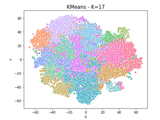

# Spotify Music Recommender System 
> Clustering based music recommender

SpotifyRecommendations is a platform that takes a user's favorite songs or a playlist as an input, predicts the cluster that it belongs and generates a new playlist based on the input songs from the predicted cluster.

The data set used for this project is the Million Playlist [dataset](https://www.aicrowd.com/challenges/spotify-million-playlist-dataset-challenge) released by Spotify.

## Dataset
Only code is available in this repository, to run this code, you need to download the dataset in /data/spotify_million_playlist_dataset.  It is a direct download from the website above.
This dataset contains 1000 slices with 1000 playlists each for a grand total of 1M playlists.

## Code
#### Get_MPD_Data.ipynb 
This notebook is used to create the main .json file containing the playlists to train the model and to generate the recommendations. The loop_slices() function will go through as many slices as desired to extract the necessary information from the playlists, it is recommended to use 20 slices to run locally and scale it as needed with a bigger instances such as AWS.

```
playlists = loop_slices(path, num_slices=1000)
```

#### Playlist_Recommendation.ipynb 
This notebook will go through the entire analysis and development for the model and the recommendations. It describes what methods are used and how those were selected.

Seven different models were selected from different families and a 2D projection with TSNE was done. At 20,000 playlists, KMeans with k=17 is the best performer.

This notebook will generate the model and the playlist dataset to be used. All the models and datasets are saved locally.

You can read all the details of the analysis [here](https://medium.com/@david.de.hernandez/the-data-3056997a0fc5) on Medium.

```
# Pickled models
model_path = 'models/KMeans_K17_20000_sample_model.sav'
tsne_path = 'models/openTSNETransformer.sav'
scaler_path = 'models/StdScaler.sav'
playlists_path = 'data/playlists.json'
train_data_scaled_path = 'data/scaled_data.csv'
```


#### oauth.ipynb 
This notebook contains the code to execute the recommender system, it is a Class where each method calls different parts of the recommender system pipeline.
It is scalable, in a way that any model and any playlists of any size can be used to generate recommendations.


Examples on how to use it
Need to call SpotifyRecommendations with the given paths for the models and data
```
x = SpotifyRecommendations(model_path, tsne_path, scaler_path, playlists_path, train_data_scaled_path)
```

This will build a playlist based on the current user logged in
```
x.build_spotify_playlist()
```

This will build a playlist based on a playlist
```
x.build_spotify_playlist(playlist='71vjvXmodX7GgWNV7oOb64')
```

Fine tune the recommendations
n: number of similar playlists
metric: type of metric, you can try 'euclidean', 'cosine', 'cityblock'
similar: True for similar False for longest distance but still within the same cluster

```
x.get_top_n_playlists(n=10, metric='cityblock', similar=True, printing=False) # Fine tune for current user
x.get_playlist_top_n_playlists(n=10, metric='cityblock', similar=True, printing=False) # Fine tune for playlist
```
After tuning, run again `build_spotify_playlist()` or `build_spotify_playlist()`

## Contributions
This project marks the completion of a Master's degree in Applied Data Science at Univeristy of Michigan.

David Hernandez - Modeling and Recommender System.

Sheila Pietono - Scale the data to an AWS instance.

Naga Sanka - Deployment to a web instance.


## Contributing
All contributions are welcomed.
1. Fork it
2. Create your feature branch
3. Commit your changes
4. Push to the branch
5. Create a new Pull Request
